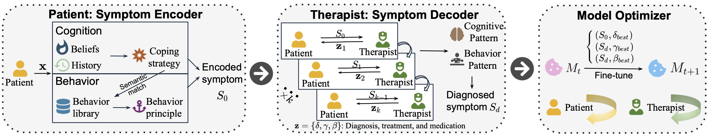

# MentalArena: Self-play Training of Language Models for Diagnosis and Treatment of Mental Health Disorders

## Introduction



Mental health disorders are one of the most serious diseases in the world. 
Most people with such a disease lack access to adequate care, which highlights the importance of training models for the diagnosis and treatment of mental health disorders. However, in the mental health domain, privacy concerns limit the accessibility of personalized treatment data, making it challenging to build powerful models.
In this paper, we introduce MentalArena, a self-play framework to train language models by generating domain-specific personalized data, where we obtain a better model capable of making a personalized diagnosis and treatment (as a therapist) and providing information (as a patient). 
To accurately model human-like mental health patients, we devise Symptom Encoder, which simulates a real patient from both cognition and behavior perspectives. To address intent bias during patient-therapist interactions, we propose Symptom Decoder to compare diagnosed symptoms with encoded symptoms, and dynamically manage the dialogue between patient and therapist according to the identified deviations.
We evaluated MentalArena against 6 benchmarks, including biomedicalQA and mental health tasks, compared to 6 advanced models. Our models, fine-tuned on both GPT-3.5 and Llama-3-8b, significantly outperform their counterparts, including GPT-4o. We hope that our work can inspire future research on personalized care. 

## Table of Contents

- [Requirements](#requirements)
- [Usage](#usage)
  - [1. Obtaining base model](#1-obtaining-base-model)
  - [2. Generate data for model optimization](#2-generate-data-for-model-optimization)
    - [2.1. MentalArena for GPT](#21-mentalarena-for-gpt)
    - [2.2. MentalArena for Llama-3](#22-mentalarena-for-llama-3)
  - [3. Iterative training via SFT](#3-other-analytical-experiments)
    - [3.1. Fine-tuning GPT models](#31-lm-steer-interpretation)
    - [3.2. Fine-tuning Llama-3](#32-lm-steer-transfer)
  - [4. Evaluation](#4-evaluation)
    - [4.1. Biomedical QA](#41-biomedical-qa)
    - [4.2. Mental health Detection](#42-mental-health-detection)


## Requirements

```
conda create -n mentalarena python=3.9
conda activate mentalarena
pip install fire numpy jsonlines torch transformers scikit-learn openai
```


## Usage

### 1. Obtaining base model and seed dataset

Get Llama-3-8b model from the website (https://huggingface.co/meta-llama/Meta-Llama-3-8B).

Get roleply-doh_principle from the website (https://huggingface.co/datasets/SALT-NLP/roleplay-doh_principles/tree/main).


### 2. Generate data for model optimization


#### 2.1. MentalArena for GPT

```bash
python arena_med.py --base_model gpt-3.5-turbo --output_file test.jsonl
```

Parameter: 
- base_model: The base model plays as a patient and a therapist. It can be the model path or model name.
- output_file: The file stores the generated data after patient-therapist interactions.


#### 2.2. MentalArena for Llama-3

```bash
python arena_med.py --base_model meta-llama/Meta-Llama-3-8B --output_file test.jsonl
```

Parameter: 
- base_model: The base model plays as a patient and a therapist. It can be the model path or model name.
- output_file: The data generated after patient-therapist interactions will be store in the file.


### 3. Iterative training via SFT


#### 3.1. Fine-tuning GPT models

```bash
python data_process.py --api_key openai key --input_file '' --finetune_file '' --base_model '' --n_epochs 3
```

Parameter: 
- api_key: OpenAI key.
- input_file: The data is generated after patient-therapist interactions.
- finetune_file: We convert the data in input_file to proper format for fine-tuning and save in finetune_file.
- base_model: The base model is the generator of the data in input_file, which will be fine-tuned on its self generated data.
- n_epochs: Number of training epoch.


#### 3.2. Fine-tuning Llama-3

First, convert the generated data into Llama format for fine-tuning and remove duplicates. Codes are in func data_process and func remove_redun(llama_finetune.py).

Then, finetune Llama models.

```bash
python llama_finetune.py --base_model '' --new_name '' --nepoch 8 --data_files ''
```

Parameter: 
- base_model: The base model is the generator of the data in input_file, which will be fine-tuned on its self generated data.
- new_name: The name of the fine-tuned model.
- n_epochs: Number of training epoch.
- data_files: The data for fine-tuning.


### 4. Evaluation

#### 4.1. Biomedical QA


```bash
python MedQA_eval.py --model meta-llama/Meta-Llama-3.1-8B-Instruct --dataset MedMCQA --name 'Anatomy'
python MedQA_eval.py --model meta-llama/Meta-Llama-3.1-8B-Instruct --dataset MMLU --name '/test/medical_genetics_test'
python MedQA_eval.py --model meta-llama/Meta-Llama-3.1-8B-Instruct --dataset MedQA 
python MedQA_eval.py --model meta-llama/Meta-Llama-3.1-8B-Instruct --dataset PubMedQA 
```

Parameter: 
- model: The model for evaluation.
- dataset: Select from 'MedQA', 'MedMCQA', 'PubMedQA' and 'MMLU'
- name: The sub-class of each dataset. This parameter only works for 'MedMCQA' and 'MMLU'.


#### 4.2. Mental health Detection

The code for evaluation on mental health detection can be found in (https://github.com/SteveKGYang/MentalLLaMA).
